= Asynchronous Game Server
:toc:
:icons: font
:stem: latexmath

== https://en.wikipedia.org/wiki/Rock_paper_scissors[Rock-Paper-Scissors] Game Server

A game server is a good example of the need for and challenges associated with
asynchronous programming.  A game server should:

* handle multiple, concurrent connections from players
* match players for individual games and referee multiple, concurrent games
* maintain consistent information about each player,
  especially when faced with unexpected input and disconnections

=== State Diagrams

The following state diagrams document the intended behavior of the
https://en.wikipedia.org/wiki/Rock_paper_scissors[Rock-Paper-Scissors] Game
Server.  Note, however, that these state diagrams are from the point of view of
one of the players (i.e., `output` indicates text that is sent to the player,
while `input` indicates text that is received from the player).  The server may
have additional (hidden) states that represent concurrently connected players,
games in progress, and other necessary server state.

The `<on disconnect>` nodes in a subgraph indicate transitions that are taken
whenever the player disconnects while at one of the states of the subgraph.
(Typically, disconnects are detected by an error when attempting to send text to
or receive text from the player.)

Click on a diagram to visit the full-size
https://en.wikipedia.org/wiki/Scalable_Vector_Graphics[SVG image]; as SVG
images, they can be arbitrarily scaled.

==== Full State Diagram

[link=./assets/state-diagram.svg]

==== Login Subgraph State Diagram

[link=./assets/login-state-diagram.svg]

==== Command-Loop Subgraph State Diagram

[link=./assets/command-loop-state-diagram.svg]

==== Play Subgraph State Diagram

[link=./assets/play-state-diagram.svg]

Note that in this state diagram, there is no `<on disconnect>` node.  Rather,
there are explicit `<disconnect>` edges for any node that also has an `output`
and/or `input` edge which could fail.  The explicit `<disconnect>` transitions
for the Play subgraph of the state diagram are necessary to ensure that a player's
forfeit is detected and recorded if they disconnect before successfully choosing
a weapon and to ensure that a player's statistics are always appropriately
updated at the end of the game.

=== Command-Line Arguments

The `rps` program uses the https://crates.io/crates/clap[`clap` (`crates.io`)]
library for parsing command line arguments and uses the
https://crates.io/crates/log[`log` (`crates.io`)] and
https://crates.io/crates/env_logger[`env_logger` (`crates.io`)] libraries for
logging.

----
$ cargo run -q -- --help
Rock-Paper-Scissors Game Server

Usage: rps [OPTIONS] [COMMAND]

Commands:
  test  Rock-Paper-Scissors Game Server Test
  help  Print this message or the help of the given subcommand(s)

Options:
      --hostname <HOSTNAME>
          RPS Game Server hostname [default: localhost]
      --port <PORT>
          RPS Game Server port [default: 8203]
      --command-timeout <SECS>
          Command (and login and password) timeout [default: 60.00]
      --play-timeout <SECS>
          Play timeout [default: 30.00]
      --weapon-timeout <SECS>
          Weapon timeout [default: 10.00]
  -l, --log-level <off|error|warn|info|debug|trace>
          Logging level [default: ERROR]
  -h, --help
          Print help
----

=== Example

The following are brief transcripts of the server and two clients.

==== Server

----
$ cargo run -q -- -l info
[INFO ] server:: Accepted [::1]:33554
[INFO ] server:client([::1]:33554;user1):: Command (`stats`)
[INFO ] server:client([::1]:33554;user1):: Command (`quit`)
[INFO ] server:client([::1]:33554):: Terminated
[INFO ] server:: Accepted [::1]:33556
[INFO ] server:client([::1]:33556;user1):: Command (`play`)
[INFO ] server:: Accepted [::1]:33558
[INFO ] server:client([::1]:33558;user2):: Command (`play`)
[INFO ] server:client([::1]:33556;user1):: Command (`play`)
[INFO ] server:referee(user2 vs user1):: Terminated
[INFO ] server:client([::1]:33556;user1):: Command (`stats`)
[INFO ] server:client([::1]:33558;user2):: Command (`stats`)
[INFO ] server:client([::1]:33558;user2):: Command (`play`)
[INFO ] server:client([::1]:33556;user1):: Command (`play`)
[INFO ] server:referee(user2 vs user1):: Terminated
[INFO ] server:client([::1]:33556;user1):: Command (`stats`)
[INFO ] server:client([::1]:33558;user2):: Command (`stats`)
[INFO ] server:client([::1]:33558;user2):: Command (`players`)
[INFO ] server:client([::1]:33556;user1):: Command (`quit`)
[INFO ] server:client([::1]:33556):: Terminated
[INFO ] server:client([::1]:33558;user2):: Command (`players`)
[INFO ] server:client([::1]:33558;user2):: Command (`quit`)
[INFO ] server:client([::1]:33558):: Terminated
^C
----

==== Client 1

----
$ ncat localhost 8203
Welcome to ROCK-PAPER-SCISSORS!

Enter username [60.00s timeout]:
user1

Welcome new user!

Enter initial password [60.00s timeout]:
pizza

Enter command {passwd,play,players,standings,stats,quit} [60.00s timeout]:
stats

user1: wins: 0, draws: 0, losses: 0, forfeits: 0

Enter command {passwd,play,players,standings,stats,quit} [60.00s timeout]:
quit
Goodbye!
[user1@box ~]$ ncat localhost 8203
Welcome to ROCK-PAPER-SCISSORS!

Enter username [60.00s timeout]:
user1
Enter password [60.00s timeout]:
pasta
Incorrect password
Enter password [60.00s timeout]:
pizza

Enter command {passwd,play,players,standings,stats,quit} [60.00s timeout]:
play

Waiting for opponent [30.00s timeout]...
Sorry, no opponents are ready to battle.

Enter command {passwd,play,players,standings,stats,quit} [60.00s timeout]:
play

Waiting for opponent [30.00s timeout]...
user1 versus user2!!
Choose your weapon {r,p,s} [10.00s timeout]:
r
user2 plays scissors; you win!

Enter command {passwd,play,players,standings,stats,quit} [60.00s timeout]:
stats

user1: wins: 1, draws: 0, losses: 0, forfeits: 0

Enter command {passwd,play,players,standings,stats,quit} [60.00s timeout]:
play

Waiting for opponent [30.00s timeout]...
user1 versus user2!!
Choose your weapon {r,p,s} [10.00s timeout]:
p
user2 forfeits; you win!

Enter command {passwd,play,players,standings,stats,quit} [60.00s timeout]:
stats

user1: wins: 2, draws: 0, losses: 0, forfeits: 0

Enter command {passwd,play,players,standings,stats,quit} [60.00s timeout]:
quit
Goodbye!
----

==== Client 2

----
$ ncat localhost 8203
Welcome to ROCK-PAPER-SCISSORS!

Enter username [60.00s timeout]:
user2

Welcome new user!

Enter initial password [60.00s timeout]:
kale

Enter command {passwd,play,players,standings,stats,quit} [60.00s timeout]:
play

Waiting for opponent [30.00s timeout]...
user2 versus user1!!
Choose your weapon {r,p,s} [10.00s timeout]:
s
user1 plays rock; you lose!

Enter command {passwd,play,players,standings,stats,quit} [60.00s timeout]:
stats

user2: wins: 0, draws: 0, losses: 1, forfeits: 0

Enter command {passwd,play,players,standings,stats,quit} [60.00s timeout]:
play

Waiting for opponent [30.00s timeout]...
user2 versus user1!!
Choose your weapon {r,p,s} [10.00s timeout]:
Timeout after 10.00s
user1 plays paper; you forfeit!

Enter command {passwd,play,players,standings,stats,quit} [60.00s timeout]:
stats

user2: wins: 0, draws: 0, losses: 1, forfeits: 1

Enter command {passwd,play,players,standings,stats,quit} [60.00s timeout]:
players

Online users:
user2

Enter command {passwd,play,players,standings,stats,quit} [60.00s timeout]:
players

Online users:
user2

Enter command {passwd,play,players,standings,stats,quit} [60.00s timeout]:
quit
Goodbye!
----
